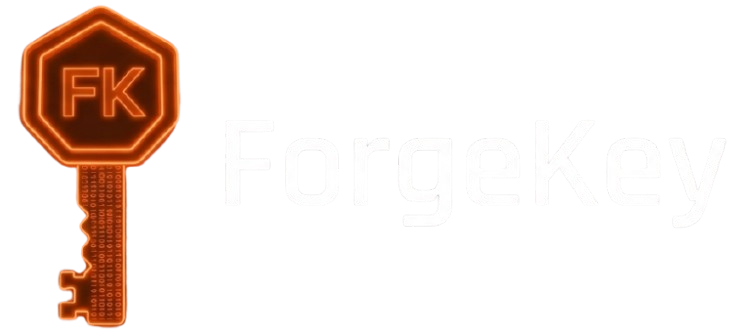

<p align="center">
  
</p>

<p align="center">
    <a href="https://github.com/vmagueta/forge/actions/workflows/ci.yml"></a>
    <a href="https://crates.io/crates/forgekey"></a>
    <a href="https://codecov.io/gh/vmagueta/forgekey"></a>
    <a href="https://docs.rs/forgekey"></a>
    <a href="LICENSE"></a>
</p>

<h3 align="center">A fast, minimal password generator CLI built in Rust.</h3>

[](https://github.com/vmagueta/forge/actions/workflows/ci.yml)
[](https://crates.io/crates/forgekey)
[](https://codecov.io/gh/vmagueta/forgekey)
[](https://docs.rs/forgekey)
[](LICENSE)

A fast, minimal password generator CLI built in Rust.

## Installation

```bash
cargo install forgekey
```

## Usage

```bash
# Generate a password (default: 16 characters)
forgekey

# Custom length
forgekey --length 32

# Generate multiple passwords
forgekey -n 5

# Exclude symbols
forgekey --no-symbols

# Exclude numbers and uppercase
forgekey --no-numbers --no-uppercase

# Combine flags
forgekey -l 32 -n 5 --no-symbols

# Copy password to clipboard
forgekey -c

# Generate a passphrase (default: 4 words)
forgekey --passphrase

# Custom word count
forgekey --passphrase --words 6

# Custom separator
forgekey --passphrase --separator "_"

# Multiple passphrases
forgekey --passphrase -n 5
```

## Options

| Flag | Short | Description | Default |
|------|-------|-------------|---------|
| `--length` | `-l` | Password length | `16` |
| `--number` | `-n` | Number of passwords | `1` |
| `--no-symbols` | | Exclude symbols | `false` |
| `--no-numbers` | | Exclude numbers | `false` |
| `--no-uppercase` | | Exclude uppercase | `false` |
| `--copy` | `-c` | Copy password to clipboard | `false` |
| `--passphrase` | `-p` | Generate a passphrase | `false` |
| `--words` | `-w` | Number of words in passphrase | `4` |
| `--separator` | | Word separator | `-` |

## Passphrase generation

Passphrases are generated using the [EFF Long Wordlist](https://www.eff.org/dice) (7776 words), the same standard used by major password managers.

## Built with

- [clap](https://crates.io/crates/clap) — CLI argument parsing
- [rand](https://crates.io/crates/rand) — Cryptographically secure randomness
- [colored](https://crates.io/crates/colored) — Terminal colors

## Contributing

Contributions are welcome! Check out the [CONTRIBUTING.md](CONTRIBUTING.md) for guidelines and ideas.

## License

MIT
